# 4DOF-Scara-ARM
* A 4DOF Scara arm designed in Solidworks and simulated in Simulation X and Simulink.
* Custom PCBs designed in Altium Designer 

# Where to find what?
* Assets -> Holds Images, Videos and GIFs about the project.
* Code -> Holds C code written to run on a micrcontroller to get the maximum running frequency.
* PCB -> Contains the PCB files.
* SimulationX -> Contains the Simulation X files and the model.
* Simulink -> Contains Simulink and MATLAB files along with PID controller.
* Solidworks -> Contains the Robot 3D Model files. The files are quite scattered but the "mates" subfolder you should find the "final_design" Assembly file. This is the main robot assembly file.

# A Quick Explanation of the Robot
* This is a 4 DOF Scara Arm desgined to pick up and place small - medium sized objects. Modeled after Yamaha YK350XG.
* Allowed movement is in 4 direction: 2D XY plane, Z Axis and Yaw rotation.  
* The PID controllers for the motors were designed in MATLAB using actual mechanical data from motor datasheets and Solidworks.
* Some renders of the Robot:  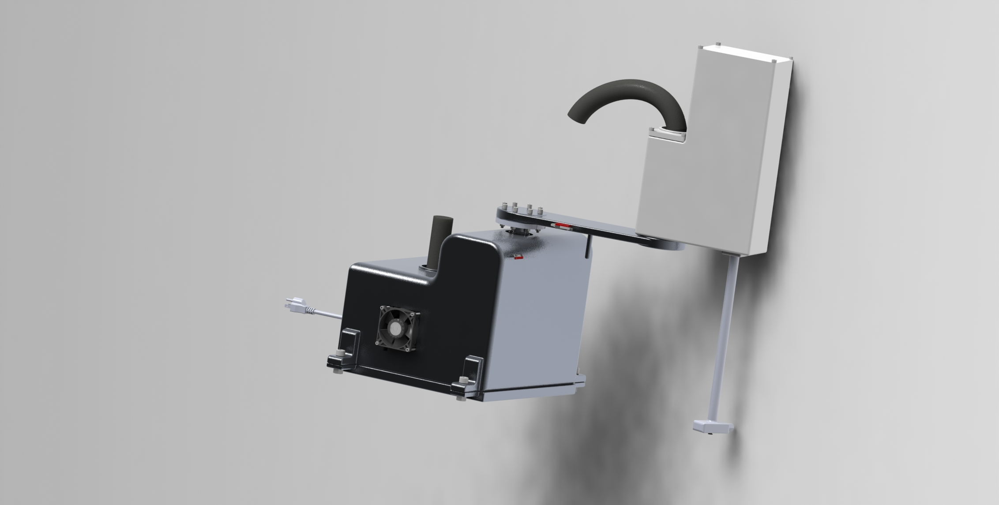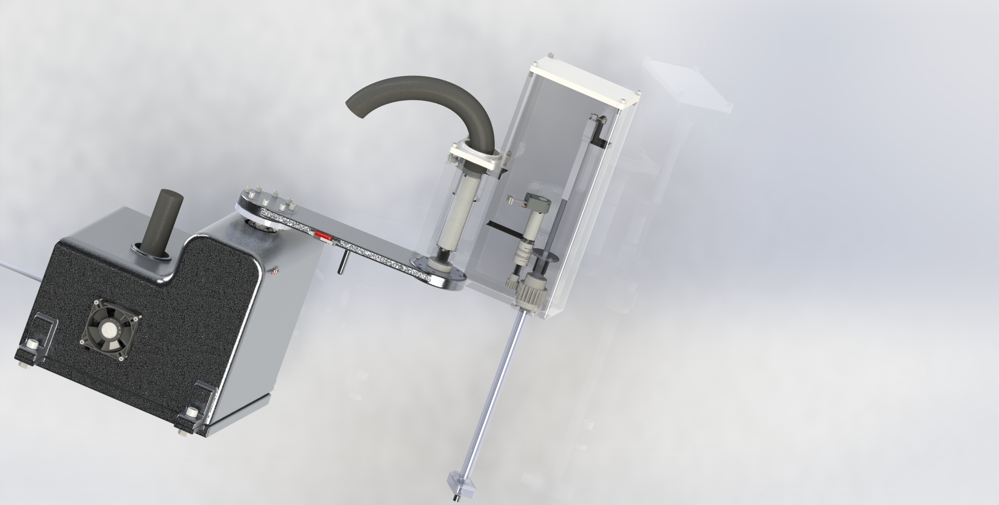
* <b>Electrical System:</b> 
  * Motherboard: Hosts all the other sub boards  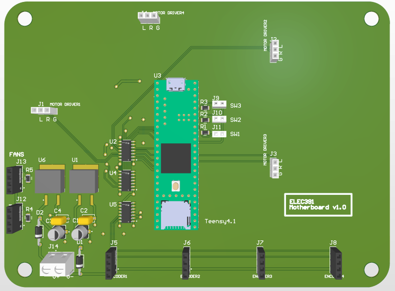 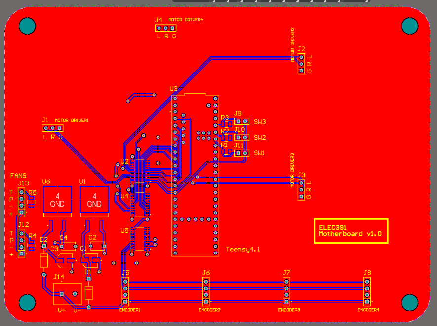
  * Motor Encoder Board: Reads and keeps track of the current angle of the motor, reads an encoder. 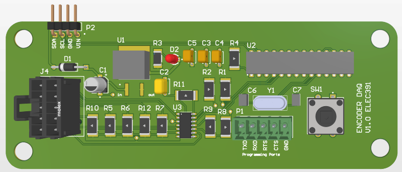 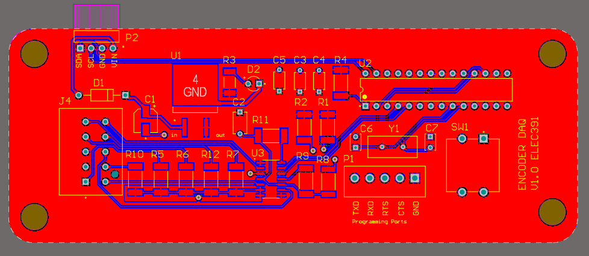
  * Motor Driver: Motor Driver designed using 4 MOSFETS, can drive motors requiring 18V at 8A. 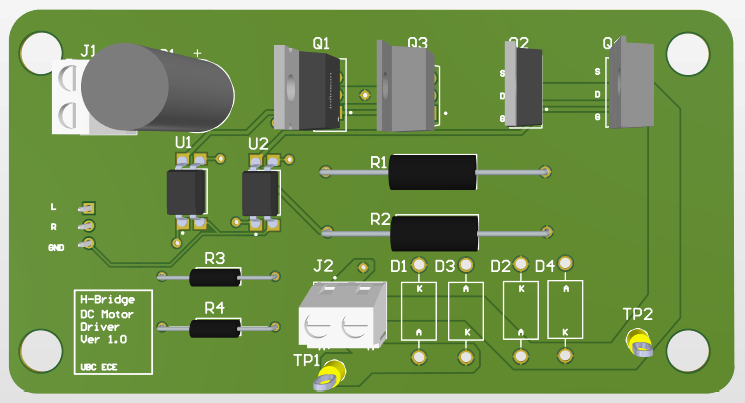 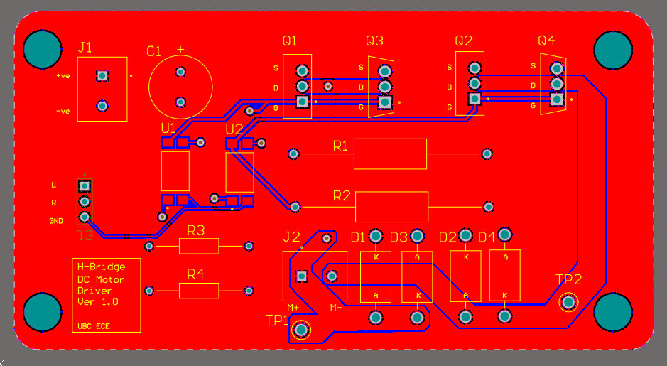 
  * Assembly of Electrical System: The system was housed in the base of the robot. 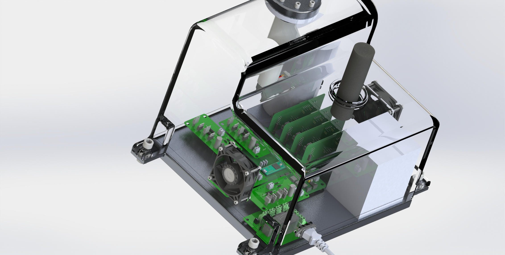
* <b>Simulink Model:</b>   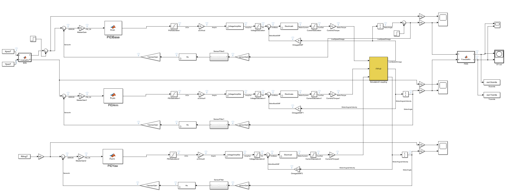
* <b>Simulation X Model:</b>   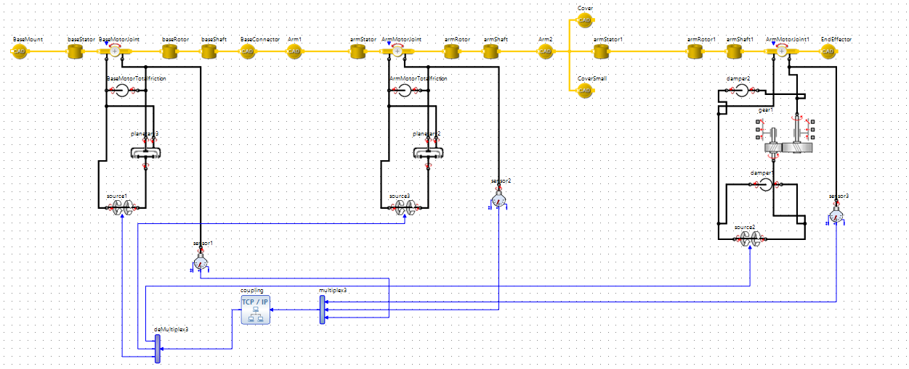
* <b>Model Simulation:</b> 
  * Exploded view of the robot  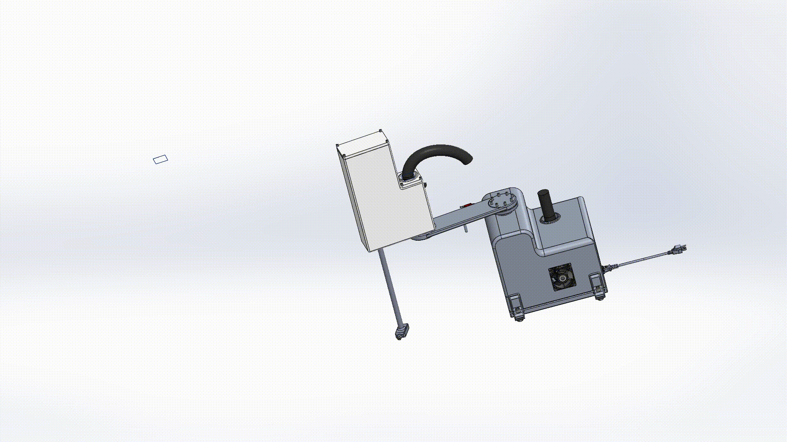
  * Endeffector: This allows the robot to move payload up/down and rotate it. There is an OTS Linear Actuator to pull the Endeffector up, rotation is carried by a motor. The objects is attached to the endeffector using vacuum. A mechanism is designed using one way valve that allows robot to pick up objecs. The following gifs show the pick up mechanism in action.  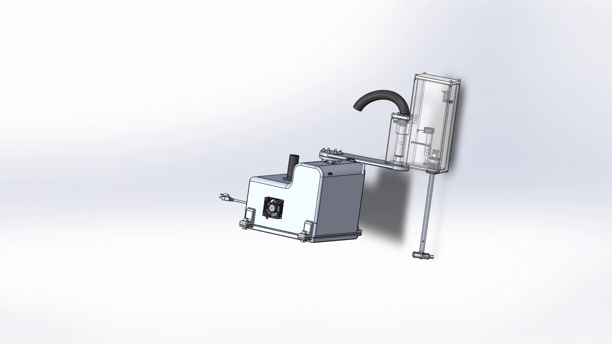  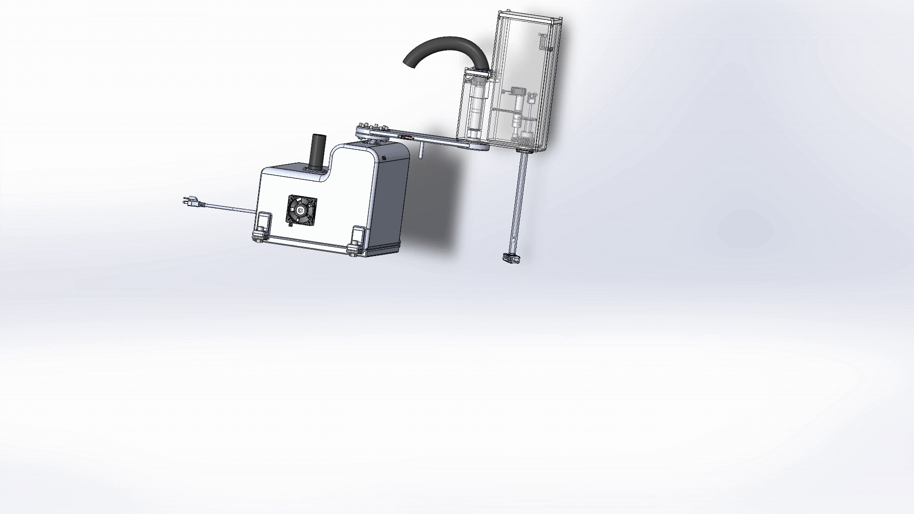
  * Robot Simulations: We did two test on the robot. The simulation was done using both SimulationX and Simulink.
    * Square Test     The result recorded i.e position data given to robot vs how it moved due to its controller and system dynamics 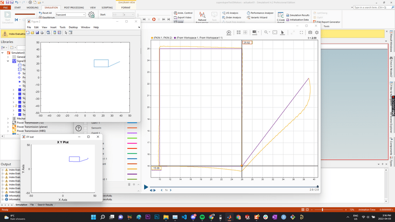   
    * Half Circle Test   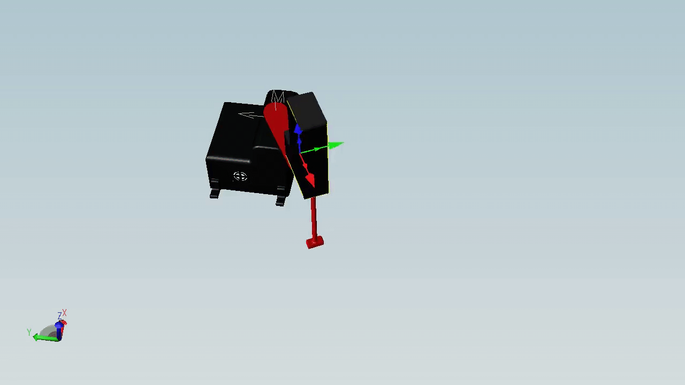   Result   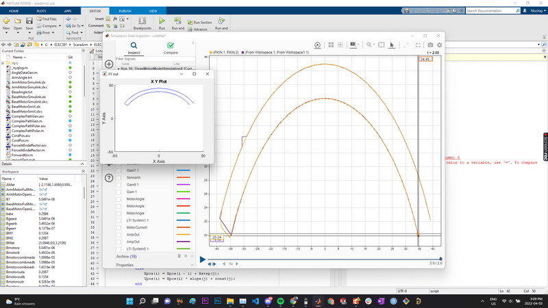
    * Rotation of the Endeffector   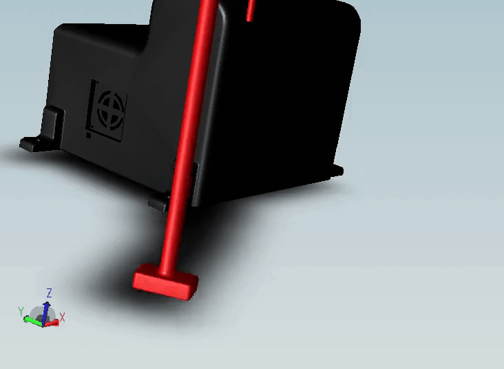   Result   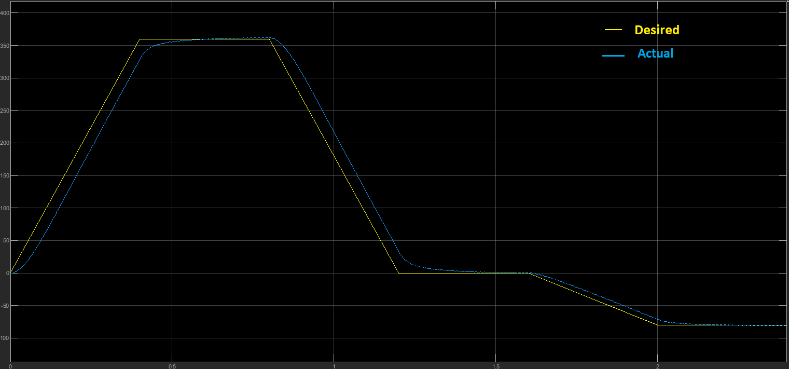
